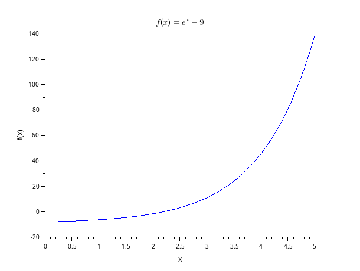
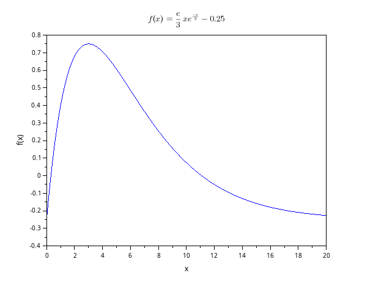
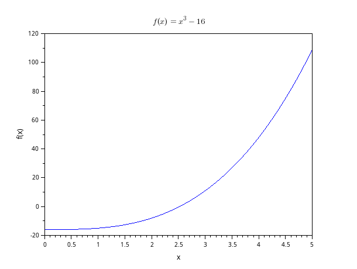
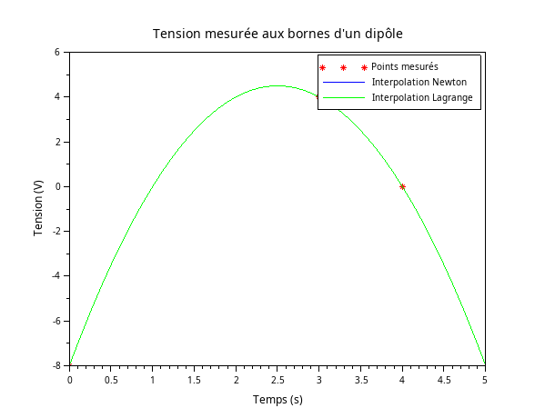

## Exercice 1

Pour pouvoir approcher la valeur de $ln(9)$, on peut utiliser une méthode de résolution d'équation, en résolvant l'équation suivante :

$$ e^x - 9 = 0 $$

{#fig:exo01}


Son résultat, $ln(9)$, peut donc être approché par une méthode telle que celle de la dichotomie ou encore celle de Newton. En traçant l'allure de $f$ ([@fig:exo01]), on remarque que la fonction s'annule près de $x = 2.2$, on va donc utiliser l'intervalle $[2 ; 3]$ pour la méthode de la dichotomie et $x_0 = 2$ pour la méthode de Newton. Les résultats sont, avec un $\epsilon = 10^{-4}$ :

* Dichotomie : $x = 2.197235$
* Newton : $x = 2.197227$

D'après la valeur donnée par Scilab de `log(9) = 2.1972246` et par une TI-89 de `ln(9) = 2.19722`, il semblerait que la méthode de Newton soit la plus précise dans ce cas, grâce à une dérivée simple à calculer.

## Exercice 2

En utilisant au moins 11 intervalles pour cette estimation par la méthode de Simpson, on a une erreur proportionnelle à $h^4 = 0.000068 < 10^{-4}$ et on a comme résultat :

$$ I \approx 0.515152 $$

Cependant, cette intégrale vaut $0.25$, on a donc ici un facteur 2 dans l'estimation, ce qui se confirme même avec les autres méthodes d'intégration :

```
Avec 11 intervalles entre 0 et 1 :

h	= 0.090909
h^2	= 0.008264
h^4	= 0.000068

Rectangle Gauche :	0.477273
Rectangle Droite :	0.522727
Point Milieu :		0.454545
Trapèzes :		0.500000
Simpson :		0.515152
Intégrale originale :	0.250000
```

## Exercice 3

Il faut que l'on résolve l'équation suivante :

$$ \displaystyle{f(x) = \frac{e}{3}x e^{\frac{-x}{3}} - 0.25 = 0} $$

{#fig:exo03}

En traçant l'allure de $f$ ([@fig:exo03]), on voit qu'elle est croissante puis décroissante, avec un maximum aux alentours de $t = 3$ heures et une courbe qui semble repasser sous 0 à partir de $t = 11$ heures. Si l'on souhaite utiliser la dichotomie, on peut donc se restreindre à l'intervalle $[3 ; 20]$. Si l'on souhaite utiliser la méthode de Newton, on peut choisir un $x_0 = 11$. Les résultats sont :

* Dichotomie : $x = 11.077925$
* Newton : $x = 11.077571$

Cela semble effectivement correspondre à l'allure de la courbe, et signifie qu'il faut planifier une nouvelle injection au bout de 11 heures.

## Exercice 4

Pour estimer la valeur de $\sqrt[3]{16}$, on peut essayer de résoudre l'équation suivante :

$$ f(x) = x^3 - 16 = 0 $$

{#fig:exo04}

En traçant l'allure de $f$ ([@fig:exo04]), on remarque que la fonction s'annule près de $x = 2.5$, on va donc utiliser l'intervalle $[2 ; 3]$ pour la méthode de la dichotomie et $x_0 = 2$ pour la méthode de Newton. Les résultats sont :

* Dichotomie : $x = 2.519867$
* Newton : $x = 2.519842$

D'après la valeur donnée par Scilab de `16^(1/3) = 2.5198421` et par une TI-89 de `16^(1/3) = 2.51984`, il semblerait que la méthode de Newton soit la plus précise dans ce cas également.

## Exercice 5

Pour répondre à cette question, on va utiliser la technique de l'interpolation. On va ainsi approximer une allure de courbe entre les 3 points de mesure donnés, à l'aide de 2 méthodes différentes. Les résultats sont :

* Lagrange : $U^* = 4.5 V$ et $t^* = 2.55 s$
* Newton : $U^* = 4.5 V$ et $t^* = 2.55 s$

Les deux méthodes donnent des résultats identiques ([@fig:exo05]), et indiquent un pic de tension de 4.5 V qui survient à 2.55 secondes.

{#fig:exo05}