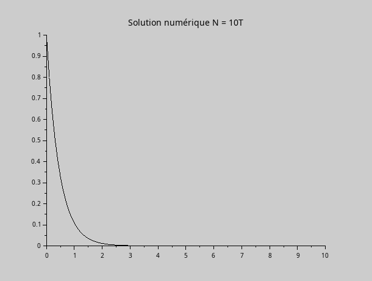

*Note : tous les codes sources sont fournis à côté.*

## Exercice 1

Dans un premier temps, on calcule $H'(x)$ à l'aide d'une dérivation numérique, puis on utilise la méthode de Simpson pour calculer $L$.

On trouve ainsi $L \approx 144.42 \text{ m}$.

## Exercice 2

Pour déterminer l'instant de la chute, il faut résoudre l'équation $h(t) = 0$. Pour cela, on va utiliser une méthode de résolution numérique par dichotomie. Voici la courbe de la fonction h :

{width=500px}

On remarque que la fonction s'annule environ en t = 1.4 s, on va donc pouvoir utiliser l'intervalle de départ $[1 ; 2]$.

On trouve le résultat suivant : le sol est atteint après 1.3767 secondes, avec 0.0001 seconde de précision.

## Exercice 3

### Question 1

La solution de cette équation différentielle est :

$$ y(t) = K e^{\lambda t}, K \in \mathbb{R} $$

Comme on a $y(0) = 1$, on trouve :

$$ \begin{aligned} y(0) & = 1 \\ Ke^{0} & = 1 \end{aligned}$$

La solution complète est donc $y(t) = e^{\lambda t} = e^{-2 t}$.

### Question 2

$$\bar{h} = \frac{2}{|\lambda|} = \frac{2}{|-2|} = 1$$

En utilisant la méthode d'Euler explicite, on obtient :

```scilab
```

{#fig:exo3_ana}
{#fig:exo3_num1}
{#fig:exo3_num4}
{#fig:exo3_num10}

On remarque que dans le cas où $h = \bar{h} = 1$, la résolution échoue et oscille entre -1 et 1. Dans les autres cas, la courbe est visuellement identique à la solution analytique.

### Question 3

On fixe T = 100. Voici plusieurs cas de figure où $\lambda$ et N ont été modifiés :

{#fig:}
{#fig:}
{#fig:}
{#fig:}
{#fig:}

On remarque qu'avec l'augmentation de T on reste stable. Cependant si l'on réduit $\bar{h}$ en deçà de -2, on devient instable.

### Question 4

En utilisant Euler implicite, on obtient :

{#fig:}
{#fig:}
{#fig:}

Dans ce cas, on reste stable malgré l'augmentation de $\lambda$.

## Exercice 4
### Question 1

$$ \begin{aligned} u_C(t) & = E - u_R(t) \\ {} & = E - R \cdot i(t) \\ {} & = E - RC \cdot \frac{du_C}{dt} \\ E & = RC \cdot \frac{du_C}{dt} + u_C(t) \\ E & = \tau \cdot \frac{du_C}{dt} + u_C(t) \\ \frac{du_C}{dt} & = \frac{-1}{\tau}u_C(t) + \frac{E}{\tau} \end{aligned} $$


### Question 2

La solution de cette équation différentielle est :

$$ u_C(t) = E(1 - e^{\frac{-t}{\tau}}) = E(1-e^{\frac{-t}{0.1}})$$

{#fig:}

### Question 3

En utilisant la méthode d'Euler implicite, on trouve :

{#fig:}

À une petite marge d'erreur près (notamment visible au niveau du "genou" de la courbe), on retrouve bien la solution attendue.